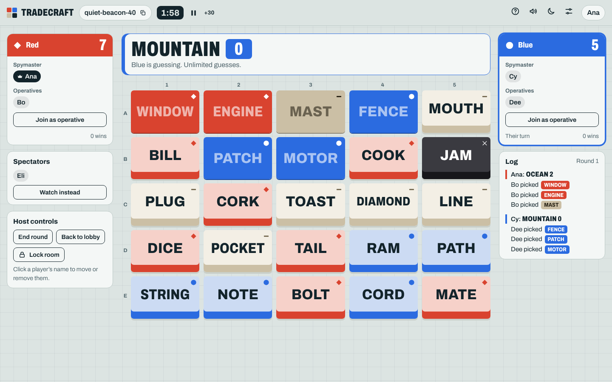
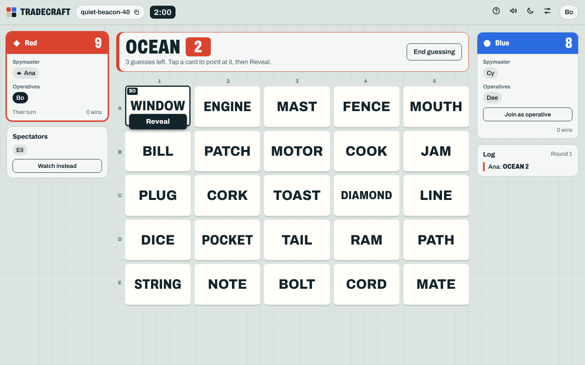
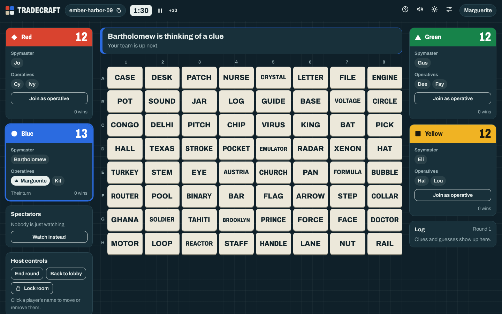
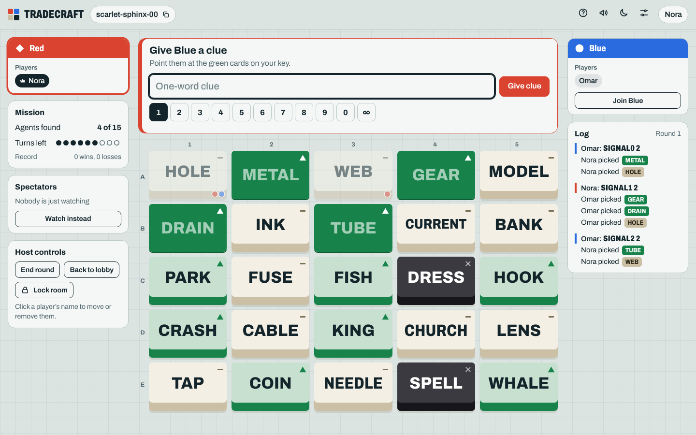
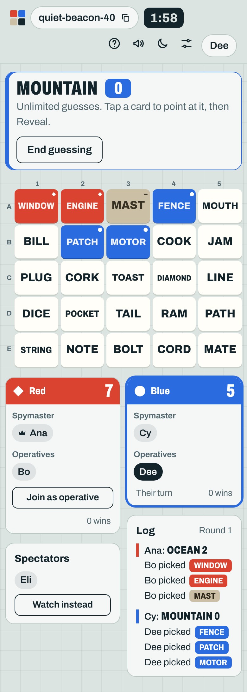

# Tradecraft

A self-hosted, real-time word game of one-word clues for two to four teams, played in the browser. Create a room, share the link, split into teams.

Tradecraft is a ground-up rewrite of [cazier/clonenames](https://github.com/cazier/clonenames). It keeps what made that project different (up to four teams, boards up to 10 × 10, plain-text word lists) and adds the things a full game needs: named players, spymaster and operative seats, clues, turn rules enforced by the server, timers, a game log, a co-op mode, reconnects, and a layout that works on a phone.



| Operative, pointing at a card | Four teams on 8 × 8, dark | Co-op | Phone |
| --- | --- | --- | --- |
|  |  |  |  |

## What you get

**The game**

- Classic mode for 2, 3 or 4 teams. The server runs the rules: clue then guesses, number + 1 guess limit, wrong card ends the turn, assassin, win detection, and elimination when three or four teams play.
- Co-op mode: two sides, one board, two different keys, 15 agents to find in a limited number of turns, then sudden death.
- Boards from 4 × 4 to 10 × 10, 0 to 3 assassins.
- Spymasters type a clue and a number (0 to 9 or ∞). Clues that are a face-down word are rejected; a stricter check is optional.
- Operatives tap a card to point at it. Everyone sees who is pointing where, then one press on Reveal commits.
- Optional clue timer and guess timer. The host can pause or add 30 seconds.
- A log of every clue and guess, and a win count per team across rounds.
- Rows and columns are labelled, so on a call you can say "C4".

**The room**

- No accounts. A room is a link like `/r/brass-otter-42`.
- The first person in is the host: start rounds, shuffle teams (spymaster duty rotates), move or remove players, hand over hosting, lock the room, rename teams.
- Players who drop reconnect into their seat. If the host disappears, hosting passes to someone else.
- Spectators can watch without seeing the key.
- The key is only ever sent to people allowed to see it. An operative's browser never receives it.
- Someone who has seen the key can't switch to guessing in the same round.

**Words**

- Eight built-in packs (about 1,200 words). Pick any combination per room.
- Paste your own words into a room, or drop word-list files on the server.
- Words aren't repeated from round to round until the pool runs out.

**Hosting**

- One small Node process, one dependency (`ws`), no build step, no database, no external requests. Fonts are bundled.
- Rooms are saved to a JSON file and survive a restart, including the clock.
- Works behind a reverse proxy, on a sub-path if you want.
- Light and dark themes, synthesised sound effects, a shape per team so colour is never the only signal.

## Run it

### Docker Compose

```sh
git clone <this repo> tradecraft && cd tradecraft
docker compose up -d --build
```

Open <http://localhost:3000>. Saved rooms and your own word lists live in `./data`.

### Docker

```sh
docker build -t tradecraft .
docker run -d --name tradecraft -p 3000:3000 -v "$PWD/data:/data" --restart unless-stopped tradecraft
```

The container runs as uid 1000. If the folder you mount is owned by someone else, add `--user <uid>:<gid>` (on Unraid that is `--user 99:100`). If the app can't write to `/data` it still runs; it just logs a warning and rooms won't survive a restart.

### Node, no container

Needs Node 20 or newer.

```sh
npm ci --omit=dev
npm start
```

A sample systemd unit is in [`deploy/tradecraft.service`](deploy/tradecraft.service).

## Configuration

Everything is an environment variable. All are optional.

| Variable | Default | What it does |
| --- | --- | --- |
| `PORT` | `3000` | Port to listen on. |
| `HOST` | `0.0.0.0` | Address to bind. |
| `SITE_NAME` | `Tradecraft` | The name shown on the page and in the browser tab. |
| `BASE_PATH` | *(empty)* | Set to e.g. `/tradecraft` to serve under a sub-path. |
| `CREATE_PASSWORD` | *(empty)* | If set, creating a room needs this password. Joining a room never does. |
| `DATA_DIR` | `./data` (`/data` in Docker) | Where `rooms.json` is written. |
| `WORDLISTS_DIR` | `$DATA_DIR/wordlists` | Folder of extra word lists. |
| `PERSIST` | `true` | Set to `false` to keep rooms in memory only. |
| `ROOM_TTL_HOURS` | `48` | Idle rooms are deleted after this long. |
| `MAX_ROOMS` | `500` | Upper limit on rooms. |
| `MAX_PLAYERS_PER_ROOM` | `64` | Upper limit on people in a room. |
| `ALLOWED_ORIGINS` | *(any)* | Comma-separated origins allowed to open the WebSocket, e.g. `https://games.example.com`. |
| `LOG_LEVEL` | `info` | `info`, `debug` or `silent`. |

## Word lists

A word list is a text file: the pack's name on the first line, then one word or short phrase per line.

```text
Office Party
# description: People and places from work
# language: en
Break room
Fire drill
Karen's stapler
```

The `# key: value` lines are optional. Put the file in `data/wordlists/` (any extension, or none) and restart. It shows up in the room settings next to the built-in packs.

This is the same layout the original Clonenames used, so lists from `src/clonenames/wordlists/` can be copied in unchanged.

The built-in packs in [`wordlists/`](wordlists) were written for this project.

## Behind a reverse proxy

The app speaks plain HTTP and one WebSocket at `/ws`. The proxy has to pass the WebSocket upgrade through.

- nginx: [`deploy/nginx.conf`](deploy/nginx.conf)
- Caddy: [`deploy/Caddyfile`](deploy/Caddyfile)
- Traefik and Nginx Proxy Manager need no special settings beyond enabling WebSocket support.

For a sub-path, set `BASE_PATH=/tradecraft` and forward `/tradecraft/` to the app. It works whether or not the proxy strips the prefix.

If you put this on the public internet, consider setting `CREATE_PASSWORD` so strangers can't open rooms on your server, and `ALLOWED_ORIGINS` to your own address.

## How it is put together

```text
server/
  index.js    HTTP (static files, small JSON API) and the WebSocket endpoint
  rooms.js    rooms, players, seats, host controls, timers, saving to disk,
              and the per-player view (who is allowed to see what)
  game.js     the rules, as pure functions over a plain object
  words.js    word-list loading
  names.js    room codes
  config.js   environment variables
public/       the client: plain HTML, CSS and ES modules, served as-is
wordlists/    built-in packs
test/         rules tests and end-to-end tests over real WebSockets
```

The server is the only source of truth. Each change produces a fresh snapshot per player, filtered to what that player may see, so a client can't learn the key by reading network traffic. State for a room is a few kilobytes, which keeps the protocol simple: clients send small actions, the server sends whole snapshots.

### API

| | |
| --- | --- |
| `GET /api/packs` | Word packs on this server. |
| `POST /api/rooms` | Create a room. Body `{ "password": "…" }` if `CREATE_PASSWORD` is set. Returns `{ "code": "…" }`. |
| `GET /api/rooms/:code` | `{ exists, players, locked }`, or 404. |
| `GET /healthz` | `{ ok, rooms, online, uptime }`. |

## Development

```sh
npm install
npm run dev     # restarts on server changes; the client has no build step
npm test        # rules tests + end-to-end tests that boot the server
```

## Compared with Clonenames

| | Clonenames | Tradecraft |
| --- | --- | --- |
| Players | Anonymous; "host" checkbox shows the key | Named players, seats per team, spectators |
| Revealing cards | Hosts click cards for their team | Operatives point and reveal; the server checks whose turn it is |
| Clues | Spoken only | Typed, validated, logged, with a guess limit |
| Turn handling | Manual "End turn" button | Automatic, with optional timers |
| Winning | Players work it out | Detected, announced, counted across rounds |
| Key secrecy | Sent to anyone who ticks "host" | Sent only to spymasters, checked on the server |
| Modes | Team play | Team play and co-op |
| Teams and board | Up to 4 teams, up to 10 × 10 | Same, plus 4 × 4 and 0 to 3 assassins |
| Word lists | Files on the server | Files on the server, plus per-room custom words and pack mixing |
| Reconnect / restart | Game is lost | Seats and rooms are restored |
| Phone layout | Desktop table | Responsive |
| Stack | Python, Flask, Socket.IO, Bootstrap, jQuery | Node, `ws`, no client framework |

## Licence and credits

GPL-3.0-or-later, the same licence as Clonenames. See [`LICENSE`](LICENSE).

- Inspired by [Clonenames](https://github.com/cazier/clonenames) by Brendan Cazier.
- The typeface is [Archivo](https://github.com/Omnibus-Type/Archivo) by Omnibus-Type, under the SIL Open Font License ([`public/fonts/OFL.txt`](public/fonts/OFL.txt)).
- The game this is modelled on, Codenames, was designed by Vlaada Chvátil and is published by Czech Games Edition. This project is not affiliated with or endorsed by them. If you enjoy it, buy the real thing.
